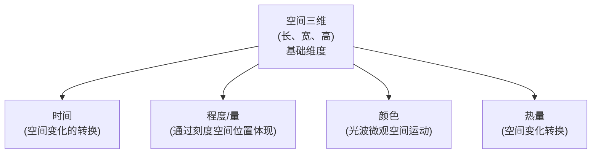

# 变化理论

> [!abstract] 变化的定义
> 变化是在单个或多个维度上形成差异量的**过程**。

## 变化的衡量

设定**开始**和**结束**：

- **变化已发生** = 至少一个维度上差异量 ≠ 0
- **变化未发生** = 所有维度上差异量均为 0

> [!warning] 变化是连续的过程
> 时间始终在走。从开始到结束是一个连续的过程，不是离散的点。

## 维度体系

### 两种空间

| 空间类型 | 说明 |
|---------|------|
| **真实世界的空间** | 人类普遍认知和科学观测层面呈现为三维 |
| **精神世界的空间** | 真实世界空间的一种转换类型，由微观运动（如神经元信号传递）构建而成，可反映真实信息也构造虚拟概念（一维线、二维面、甚至四维五维） |

## 两种变化类型

### 绝对性变化

- 考量**所有维度**
- 时间维度（空间变化的转换）必然存在差异量
- **绝对性变化永远存在**

### 相对性变化

- 聚焦**某个或某几个维度**，忽略其他维度
- 例：观察人是否移动 → 只评估空间位移维度

## 空间变化的基础地位

> [!quote] 原话
> "从客观世界来讲，空间性的变化是最基础的，时间性的变化是人类主观定义的。"

| 变化类型 | 本质 |
|---------|------|
| 时间性变化 | 空间变化的转换（钟表指针移动→时间） |
| 程度变化 | 通过刻度空间位置体现 |
| 颜色变化 | 微观空间运动（光波） |

---

> [!seealso] 相关内容
> - [[构词规则]] — 元音表达"变化类型"，辅音表达"变化规则"
> - [[音a — 空间变化]] — /a:/ 作为"空间变化"的承载者
