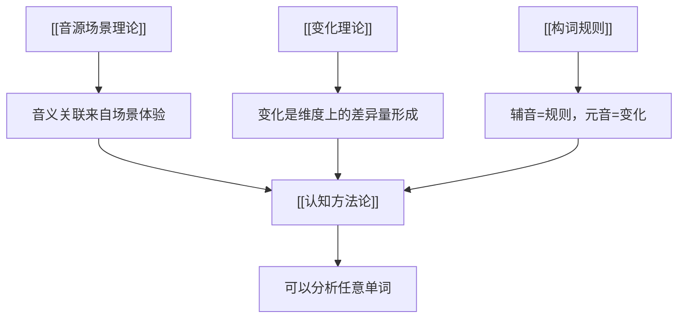

# 认知方法论

## 认知演化链条（完整版）

### 从混沌到概念的全过程

```
混沌状态（一切信息未分化）
    ↓
需求驱动（生存需要产生了关注的方向）
    ↓
选择性观察（从混沌中选取关注的信息）
    ↓
获取信息（各维度的变化信息）
    ↓
信息比对（同一维度前后变化产生信息差）
    ↓
辨识差异（从信息差中识别出有意义的变化）
    ↓
认知积累（多次辨识的认知沉淀）
    ↓
概念形成（对一类变化模式的抽象提炼）
    ↓
寻找载体（需要一个音/形来表达这个概念）
    ↓
表达与交流（通过载体传递概念）
```

### 简化的认知链条


## 分步解析

### 1. 观察 → 认知
人类通过观察场景获得认知。场景包含各种感官信息。

### 2. 具象概念
对认知思考后形成具体的概念。
> 例：手形成夹角抓住东西 → **"抓握"**这个具象概念

### 3. 抽象化
通过不断迭代认知，逐渐将具象概念抽象化。
> 例："手形成夹角抓住东西" → **"从无到有形成夹角占据空间"**

> [!tip] 抽象化的关键
> 去掉具体载体（手），保留本质结构（线对折 → 夹角 → 占据空间）

### 4. 泛化
将抽象概念泛化，使其可应用于各种场景。
> 例：g 的"形成夹角占据空间" → 可应用于手抓、拥抱、占据地盘、占据位置等

### 5. 反向应用
用抽象概念的本质去理解/描述其他相似或相同的场景。

## 视角原则

> [!important] 同一场景，不同视角 → 不同概念
> 
> 观察者的**关注焦点或角度不同**，想表达的概念就不同。

### 示例：伸手抓苹果

| 观察焦点 | 表达的概念 | 使用的词 |
|---------|-----------|---------|
| 大拇指与食指之间的**空间关系** | 空的空间、缝隙 | gap |
| **苹果填满空间**的状态 | 填满、抓握 | hold / grasp |
| 手**闭合**的动作 | 闭合过程 | close / grip |

### 意义
- 一个音素组合描述的不是客观场景的全部，而是**观察者选择的焦点**
- 同一个音素组合（如 gap）在不同焦点下可以表达不同但相关的概念
- 分析时需要识别：这个单词选择了哪个**视角**来切割场景

## 分化理论

**场景：** 一张纯白的纸张，在中间折一下，折痕产生了。

原本一张完整的纸没有折痕，是一体的；折了之后，纸的内部出现了**边界**——即折痕。

### 分化的本质

分化不是A和B两个独立的东西拼到一起，而是**从整体内部"长出"边界**，把原来的一体分割成了不同的部分。

- **线与面的分化**：折痕之所以被认为是"线"，是因为宽度远小于长度——这是维度差异比对的结果
- **点与线的分化**：点的长度和宽度都很小；线的长度显著大于宽度

### 信息比对是认知的基础

> "假设一个人天生眼瞎，从来没有见过黑色，他能不能想象出黑色？"

没有信息比对的基础，就无法形成概念。任何辨识都涉及多维度信息比对。

## 共识理论

> "自由这个概念，每个人的理解都不相同。沟通之所以可能，是因为两个人的理解之间存在交集。"

- 概念是**私人的**——每个人的认知体系都不同
- 沟通的有效性取决于**交集的大小**
- 共识不是"完全一致"，而是"交集足够大，使得沟通在目标范围内有效"

## 语言代沟（信息衰减）

> 教小孩表达"膨胀"这个概念时，只告诉他"这个/b/表达膨胀"，但不会告诉他"为什么/b/表达膨胀"。

每一代语言传递都会丢失一层"为什么"——原初场景被遗忘，只有符号被保留下来。就像画老虎：起初画师观察真实老虎后画出简笔虎，一代代传下去越画越简化，后来的人只知其形不知其源头。

## 概念载体与表达

概念形成不等于已经拥有载体。知道"要表达什么"和"找到表达方式"是两个不同的过程：
- 认知积累够了，知道要表达什么
- 但找到合适的音/动作/符号来表达它，是艰难的过程
- 表达能力的提升本身就是协作能力的提升

## 音不是组合出来的，是场景中整体被感知后拆解的

> [!quote] 关键纠正
> "ba是场景音，不是你所说的组合音"

ba是在场景中整体被体验的，不是b和a拼凑出来的。b和a是事后分析拆解出来的音素。音b只有通过拆解才能获得，它不单独作为场景存在。

## 空间关系对比形成概念

> "支撑点和安置物两者的空间关系对比形成的概念"

孤立的物体没有"上/下"的概念——"上"之所以为"上"，是因为下方存在一个支撑点作为参照系。概念来自于**对比关系**而不是固有属性。

## 核心原则

- **具象 → 抽象 → 泛化** 是认知发展的自然路径
- 音与义的关联不是任意的，而是沿着这个认知链条自然演化的
- 理解一个音的本质运动现象，可以预测它在不同场景中的语义应用

## 与项目的关系



---

> [!quote] 用户原话
> "人类观察，认知，思考，形成具象概念，在不断迭代认知，逐渐抽象具象概念，然后泛化获取抽象概念，然后通过抽象概念的本质去描述其他相似或相同的场景概念。"
